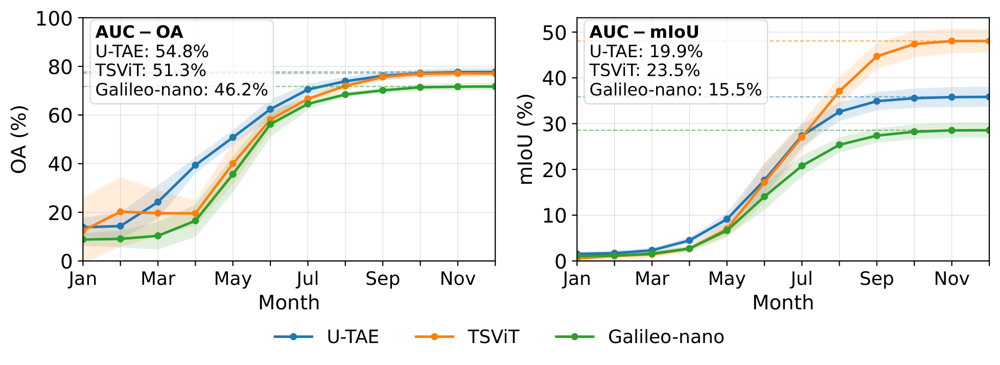

# SwissCrop25

A national benchmark dataset and codebase for operational crop mapping in Switzerland, providing Sentinel-2 time series, daily temperature data, and parcel-level crop type labels across seven growing seasons (2019–2025).

**SwissCrop25: A National Multi-Year Benchmark for Operational Crop Mapping**  
(TerraBytes II Workshop, ECCV 2026) — [[Paper]](https://arxiv.org/abs/2608.09497) [[Dataset]](https://huggingface.co/datasets/EOA-team/SwissCrop25) [[Team]](https://www.eoa-team.net/)


---

## Repository structure

```
src/                    model architectures and dataset loaders
  utae/                 U-TAE and supporting modules (L-TAE, FiLM, FPN, ConvLSTM, ConvGRU)
  tsvit/                TSViT implementation
  galileo/              Galileo segmentation wrapper and model definition
  learning/             loss functions and metrics
train_utae.py           training script for U-TAE
train_tsvit.py          training script for TSViT
train_galileo.py        training script for Galileo
scripts/
  preprocessing/        dataset construction (ground truth, temperature, Kerchunk indices)
  analysis/             baselines, per-class metrics, in-season evaluation
  figures/              figure generation scripts
  tables/               LaTeX table generation scripts
runScripts/             SLURM run scripts for all experiments and splits
storage/                per-experiment evaluation metrics (.pkl)
```

---

## Dataset

The dataset is hosted on Hugging Face: [EOA-team/SwissCrop25](https://huggingface.co/datasets/EOA-team/SwissCrop25). Download it and pass the root via `--dataset_folder`:

```bash
--dataset_folder /path/to/SwissCrop25
```

The training scripts expect `sentinel2/`, `labels/`, and `temperature/` subdirectories, matching the Hugging Face repository layout. For data structure, loading examples, class definitions, and per-year statistics, see the [dataset card](https://huggingface.co/datasets/EOA-team/SwissCrop25).

### Evaluation protocol

SwissCrop25 defines a five-fold **leave-one-year-out (LOYO)** protocol. Each split holds out one calendar year as the test set, uses the immediately preceding year for validation, and trains on all remaining years. The two partial years (2019–2020) are included as training data only due to incomplete national coverage.

| Split | Test | Val  | Train                        |
|-------|------|------|------------------------------|
| S1    | 2021 | 2020 | 2019, 2022–2025              |
| S2    | 2022 | 2021 | 2019–2020, 2023–2025         |
| S3    | 2023 | 2022 | 2019–2021, 2024–2025         |
| S4    | 2024 | 2023 | 2019–2022, 2025              |
| S5    | 2025 | 2024 | 2019–2023                    |

### Benchmarks

Results under the LOYO protocol (mean ± std across five splits, best temporal encoding per model):

| Model             | OA (%)     | GIoU (%)   | mIoU (%)   | mF1 (%)    |
|-------------------|:----------:|:----------:|:----------:|:----------:|
| U-TAE             | 77.7 ± 1.5 | 63.5 ± 2.0 | 35.8 ± 2.3 | 45.7 ± 2.4 |
| TSViT             | 77.1 ± 1.2 | 62.7 ± 1.6 | 48.1 ± 2.7 | 60.7 ± 2.5 |
| Galileo-nano (FT) | 72.9 ± 1.3 | 57.4 ± 1.6 | 30.4 ± 2.2 | 41.1 ± 2.5 |

Full per-split and per-class results are reported in the [paper](https://arxiv.org/abs/2608.09497).



*In-season OA (left) and mIoU (right) as a function of month cutoff (mean ±1 std across five LOYO splits). U-TAE leads early-season OA; TSViT gains a late-season advantage in mIoU.*

---

## Training

### Temporal encoding

The training scripts support two phenological alignment strategies evaluated in the paper, both applied on top of cloud filtering:

- **T³S** / `gddsub` (`--use_temperature_calendar --use_temperature_subsampling`): thermal time-based temporal subsampling that selects observations at fixed GDD intervals rather than calendar dates ([Turkoglu et al. 2026](https://arxiv.org/abs/2506.12885))
- **TPE** / `gddpe` (`--use_gdd_pe`): thermal positional encoding that replaces day-of-year timestamps with cumulative GDD ([Nyborg et al. 2022](https://arxiv.org/abs/2203.09175))

The DOY baseline (`cloudsub`) uses cloud filtering with calendar-based timestamps (neither flag). The training examples below use the best-performing configuration per model: T³S + TPE for U-TAE and TSViT, T³S only for Galileo-nano (whose pretrained positional encoding is fixed).

All three models are trained with distributed data-parallel using `torch.distributed.run`. Example for a single node with 4 GPUs (LOYO split S1):

**U-TAE** (GDD substitution + GDD positional encoding):
```bash
python -m torch.distributed.run --nproc_per_node=4 train_utae.py \
    --dataset_folder /path/to/SwissCrop25 \
    --epochs 15 --num_workers 12 \
    --bias_initialization --no_normalize_timestamps \
    --use_gdd_pe --use_temperature_calendar --use_temperature_subsampling \
    --satellite sentinel --w_ce 1.0 --use_class_balance_loss \
    --ablation_split S1 --res_dir ./storage/utae_gddsub_gddpe_S1 --seed 7777
```

**TSViT** (GDD substitution + GDD positional encoding):
```bash
python -m torch.distributed.run --nproc_per_node=4 train_tsvit.py \
    --dataset_folder /path/to/SwissCrop25 \
    --epochs 15 --num_workers 12 \
    --bias_initialization --variable_t \
    --use_gdd_pe --use_temperature_calendar --use_temperature_subsampling \
    --satellite sentinel --w_ce 1.0 --use_class_balance_loss \
    --batch_size 4 --accumulate_steps 4 \
    --ablation_split S1 --res_dir ./storage/tsvit_gddsub_gddpe_S1 --seed 7777
```

**Galileo-nano** (fine-tuned, GDD substitution):
```bash
python -m torch.distributed.run --nproc_per_node=4 train_galileo.py \
    --dataset_folder /path/to/SwissCrop25 \
    --model nano --epochs 15 --num_workers 12 \
    --bias_initialization --no_normalize_timestamps --variable_t \
    --use_temperature_calendar --use_temperature_subsampling \
    --satellite sentinel --w_ce 1.0 --use_class_balance_loss \
    --batch_size 2 --accumulate_steps 8 \
    --ablation_split S1 --res_dir ./storage/galileo_nano_gddsub_S1 --seed 7777
```

Complete SLURM run scripts for all experiments and splits are provided in `runScripts/`.

### Environment

#### Training

Built on [NVIDIA PyTorch container 24.12](https://docs.nvidia.com/deeplearning/frameworks/pytorch-release-notes/rel-24-12.html). Additional packages:

```bash
pip install -r requirements.txt
```

#### Preprocessing

Built on the [b-data R+QGIS devcontainer](https://github.com/b-data/data-science-devcontainers/blob/main/.devcontainer/r-qgisprocess/devcontainer.json). Additional Python packages:

```bash
pip install -r requirements_preprocess.txt
```

The ground truth generation script (`scripts/preprocessing/generateGT.py`) calls R via subprocess. Required R packages: `terra`, `stars`, `sf`, `exactextractr`, `optparse`.

### Galileo weights

Galileo pretrained weights are available on [Hugging Face](https://huggingface.co/nasaharvest/galileo). Download them with:

```bash
pip install "huggingface_hub[cli]"
huggingface-cli download nasaharvest/galileo --include "models/**" --local-dir galileo_weights
```

This places the weights at `galileo_weights/models/{nano,base}/`, matching the default `--galileo_encoder_path` in `train_galileo.py`.

---

## Reproducing results

Evaluation metrics are stored as `.pkl` files in `storage/` after training. To reproduce tables and figures from the paper, use the scripts in `scripts/tables/` and `scripts/figures/`. For example:

```bash
python scripts/tables/generate_results_table.py
python scripts/figures/confmat_figure.py
```

Baselines (majority vote, previous year) can be recomputed with:

```bash
python scripts/analysis/compute_baselines.py
```

---

## Citation

```bibtex
@misc{lauber2026swisscrop25nationalmultiyearbenchmark,
  title         = {SwissCrop25: A National Multi-Year Benchmark for Operational Crop Mapping},
  author        = {Thomas Lauber and Mehmet Ozgur Turkoglu and Sélène Ledain and Helge Aasen},
  year          = {2026},
  eprint        = {2608.09497},
  archivePrefix = {arXiv},
  primaryClass  = {cs.CV},
  url           = {https://arxiv.org/abs/2608.09497}
}
```

---

## License

Code released under the [MIT License](LICENSE). Data released under [CC BY 4.0](https://creativecommons.org/licenses/by/4.0/) — license and full attribution details on the [dataset card](https://huggingface.co/datasets/EOA-team/SwissCrop25).

This repository builds on [U-TAE](https://github.com/VSainteuf/utae-paps) (MIT), [TSViT/DeepSatModels](https://github.com/michaeltrs/DeepSatModels) (Apache 2.0), and [Galileo](https://github.com/nasaharvest/galileo) (MIT).

---

## Contact

- Thomas Lauber — thomas.lauber@agroscope.admin.ch
- Helge Aasen — helge.aasen@agroscope.admin.ch
- [Earth Observation of Agroecosystems Team, Agroscope](https://www.eoa-team.net/)
